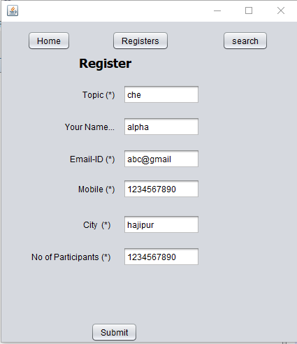
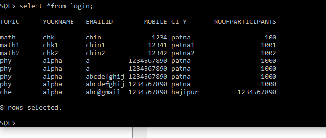
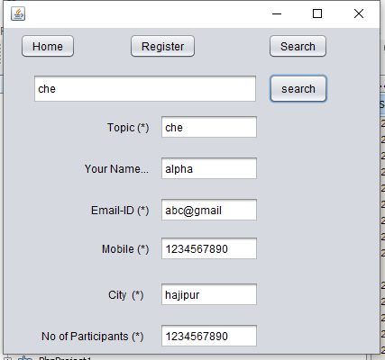

# Sarvey-page-in-java-
Record the user content to the database.
Insert the user data in database (Data base used is oracle 10g), with desired text filled and submit.
file name is reg.java

Data base entry

search page result

